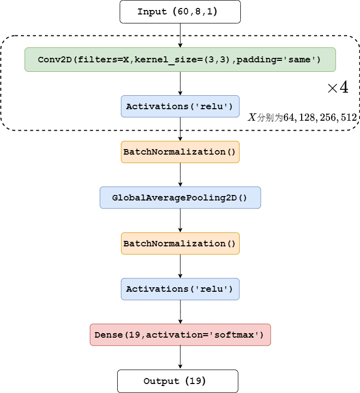
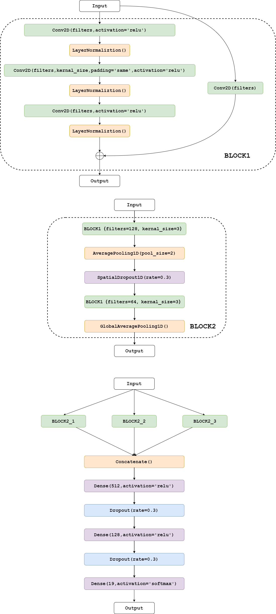
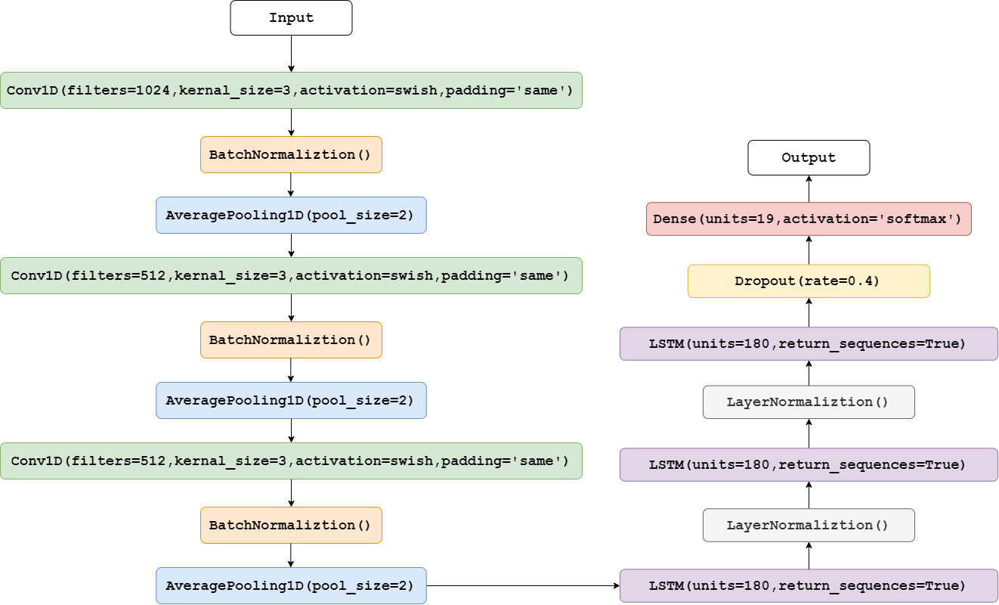
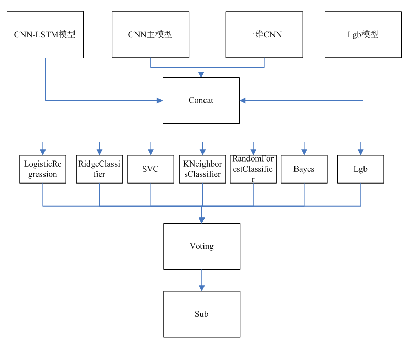

# 新网银行金融科技挑战赛 AI算法赛道 Top20
比赛地址：https://www.kesci.com/home/competition/5ece30cc73a1b3002c9f1bf5/content/2

团队名字：渣渣炼丹师

data：数据集。
model：为训练时产生的模型放到这个文件夹里面。
npy_file：每个模型训练完毕产生的npy文件会放里面。

最终stacking生成submit文件在code/目录下。

一、执行Conv2dModel.py文件，生成"伪标签"文件，Conv1dModel.py文件需要用到。
python Conv2dModel.py
模型结构：

二、执行Conv1dModel.py文件
python Conv1dModel.py

三、执行Conv1dLSTM.py文件
python Conv1dLSTM.py

四、执行LgbModel.py文件
python LgbModel.py

五、执行Stacking.py文件
python Stacking.py
